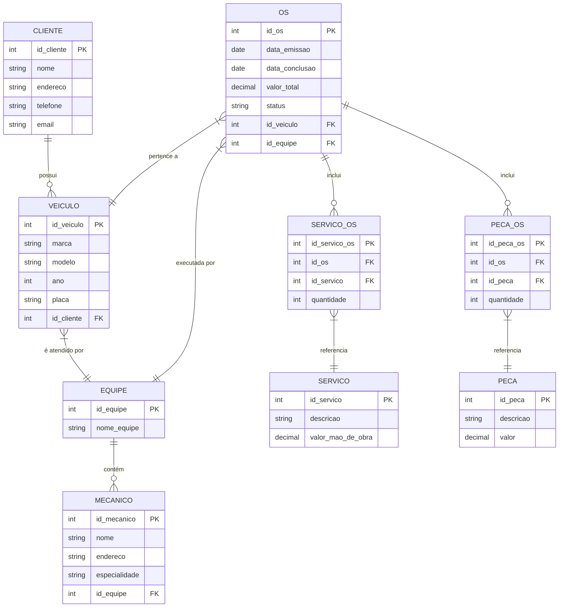

```mermaid
erDiagram
  CLIENTE ||--o{ VEICULO : possui
  VEICULO }|--|| EQUIPE : "é atendido por"
  EQUIPE ||--o{ MECANICO : "contém"
  OS ||--o{ SERVICO_OS : "inclui"
  OS ||--o{ PECA_OS : "inclui"
  SERVICO_OS }|--|| SERVICO : "referencia"
  PECA_OS }|--|| PECA : "referencia"
  OS }|--|| VEICULO : "pertence a"
  OS }|--|| EQUIPE : "executada por"

  CLIENTE {
    int id_cliente PK
    string nome
    string endereco
    string telefone
    string email
  }

  VEICULO {
    int id_veiculo PK
    string marca
    string modelo
    int ano
    string placa
    int id_cliente FK
  }

  EQUIPE {
    int id_equipe PK
    string nome_equipe
  }

  MECANICO {
    int id_mecanico PK
    string nome
    string endereco
    string especialidade
    int id_equipe FK
  }

  OS {
    int id_os PK
    date data_emissao
    date data_conclusao
    decimal valor_total
    string status
    int id_veiculo FK
    int id_equipe FK
  }

  SERVICO {
    int id_servico PK
    string descricao
    decimal valor_mao_de_obra
  }

  PECA {
    int id_peca PK
    string descricao
    decimal valor
  }

  SERVICO_OS {
    int id_servico_os PK
    int id_os FK
    int id_servico FK
    int quantidade
  }

  PECA_OS {
    int id_peca_os PK
    int id_os FK
    int id_peca FK
    int quantidade
  }
```
